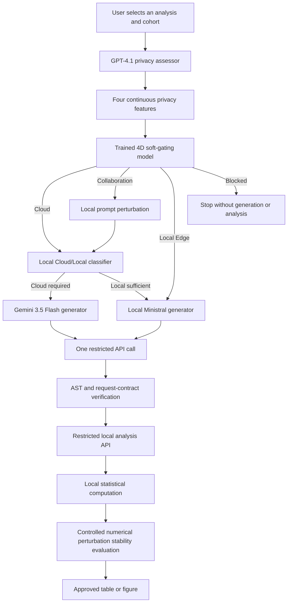

# Privacy- and Cost-Aware LLM Routing for Athlete Data Analysis

> Bachelor Thesis software artifact: a safe natural-language interface for statistical analysis of synthetic athlete data.

## At a glance

This thesis asks a practical question:

> How can an athlete analytics system use cloud and local large language models without exposing athlete records or allowing an LLM to execute arbitrary code?

The proposed system separates this problem into four controlled decisions:

1. **Privacy routing:** a GPT-4.1 privacy assessor produces four semantic risk features; a trained soft-gating model selects `Cloud`, `Collaboration`, `Local Edge`, or `Blocked`.
2. **Cost-aware model routing:** when cloud processing is permitted, a local classifier chooses between Gemini 3.5 Flash and local Ministral-3-8B.
3. **Restricted code generation:** the selected LLM may generate only one schema-constrained analysis call.
4. **Local verification and execution:** the call is validated, executed against local synthetic data, and checked again before its result is displayed.

The athlete dataframe is **never sent to an LLM**. The models see only a textual analysis request and an approved API schema. All statistical computation remains in the local Python backend.

```text
Natural-language request
        |
        v
GPT-4.1 privacy assessment -> 4D soft gating
        |
        +-- Cloud ---------> Cloud/Local router ----+
        +-- Collaboration -> prompt protection -----+--> Gemini or Ministral
        +-- Local Edge ------------------------------+--> Ministral only
        +-- Blocked ------------------------------------> stop
                                                         |
                                                         v
                                      one restricted analysis call
                                                         |
                                                         v
                                      verify -> execute locally -> display result
```

## Thesis objective

Cloud LLMs are useful for translating natural-language questions into analytical operations, but athlete data can contain identifying, medical, genetic, psychological, biometric, and performance-related information. A single cloud/local choice is therefore insufficient: the system must first decide whether cloud processing is acceptable and then decide whether cloud capability is actually necessary.

This prototype studies three research questions:

1. Can semantic privacy features support useful routing among cloud, protected collaboration, local execution, and blocking?
2. Can a task-specific classifier reduce cloud-model usage while retaining correct restricted code generation?
3. Can schema-guided prompting and deterministic verification prevent generated code from escaping a small analytical interface?

The contribution is the complete safety pipeline, not a new statistical method or a formal privacy mechanism.

## Main contributions

- A **four-dimensional privacy representation**: overall risk, subject scope, data sensitivity, and disclosure level.
- A trained **soft-gating privacy router** with four outcomes: Cloud, Collaboration, Local Edge, and Blocked.
- A project-specific **Cloud/Local router** trained from verified Gemini and Ministral outcomes.
- A **schema-guided code-generation prompt** that exposes analytical contracts rather than athlete records.
- An AST- and contract-based **generated-call verifier** followed by local execution.
- A restricted local API that keeps athlete rows inaccessible to generated code and exposes only approved analyses, including anonymous individual profiles.
- Controlled experiments for privacy routing, prompt design, cloud/local selection, and numerical perturbation.
- A deterministic dataset of **300 synthetic athletes across eight sports**; no real athlete records are included.

## End-to-end architecture



The runtime is orchestrated by [`sports/service.py`](sports/service.py). Its `handle_user_request(...)` entry point records each pipeline decision for inspection in the Streamlit interface.

### Privacy-route semantics

| Route | Interpretation | Runtime behavior |
|---|---|---|
| **Cloud** | Low-risk request | The local Cloud/Local classifier selects Gemini or Ministral. |
| **Collaboration** | Cloud use is permitted only after prompt protection | Sensitive prompt entities are perturbed locally before model selection and cloud use. |
| **Local Edge** | Downstream cloud code generation is not permitted | The Cloud/Local classifier is bypassed and local Ministral is forced. |
| **Blocked** | The request asks for prohibited disclosure | No code is generated and no analysis is executed. |

Privacy-assessment or gating failures fall back to Local Edge. Cloud/Local routing failures also select the local generator.

## Security boundary

The LLM is a translator, not an execution engine. Its only accepted output is one assignment of the form:

```python
result = analysis.<approved_method>(<approved_arguments>)
```

Before local execution, the verifier checks that:

1. the output contains exactly one restricted assignment;
2. the method and arguments are allowlisted;
3. the call matches the analysis and filters requested by the user;
4. imports, file access, network access, arbitrary statements, `exec`, and `eval` are absent;
5. the call succeeds through `RestrictedAnalysisAPI`; and
6. the returned object follows the expected safe result schema.

The restricted API does not expose its internal dataframe to generated code. Athlete rows remain local, analyses execute in the local backend, and only verified analysis results reach the interface. Individual analysis is limited to an anonymous standardized profile. Controlled numerical perturbation evaluates the stability of supported outputs; it is an experiment, not a formal privacy guarantee.

### Important interpretation

GPT-4.1 receives the original textual request because it is the privacy assessor. It does **not** receive the athlete dataframe. Consequently, this thesis demonstrates privacy-aware routing for downstream code generation and data analysis; it does not claim that the original prompt is screened entirely on-device.

## Experimental design and saved results

The repository separates training data, independent benchmarks, detailed predictions, trained models, and summary artifacts. The values below are read from the saved final-thesis artifacts; they are not recomputed when the application starts.

| Experiment | Final saved result | Artifact |
|---|---:|---|
| Cloud/Local router, valid independent cases | **96.0% routing accuracy** on 25 valid labels; 15 additional cases were invalid for ground-truth comparison | `artifacts/athlete_cloud_local_router_evaluation.json` |
| Cloud/Local router usage | **40.0% cloud usage** on the valid independent cases | `artifacts/athlete_cloud_local_router_evaluation.json` |
| Cloud restricted-prompt design | **67.5% fully correct**, compared with 0.0% for Simple and 25.0% for Medium | `evaluation/results/prompt_design_v2/codegen_prompt_design_v2_summary.json` |
| Local restricted-prompt design | **55.0% fully correct**, compared with 0.0% for Simple and 50.0% for Medium | `evaluation/results/local_prompt_design_v2/local_codegen_prompt_design_v2_summary.json` |
| Full privacy prompt, controlled benchmark | **90.625% exact route accuracy** | `evaluation/results/prompt_ablation/privacy_prompt_ablation_summary.json` |
| Full privacy prompt, independent benchmark | **41.67% exact route accuracy** | `evaluation/results/prompt_ablation/privacy_prompt_ablation_summary.json` |

These results answer different questions and should not be combined into one overall system-accuracy number. The privacy benchmark evaluates route selection; the Cloud/Local benchmark evaluates model-tier selection; the prompt experiments evaluate verified code-generation correctness.

### Final evaluation components

| Thesis component | Main implementation | Benchmark or result |
|---|---|---|
| Privacy routing | `privacy/prism_router.py` | `evaluation/frontend_realistic_benchmark_60.json` |
| 4D soft gating | `privacy/llm_soft_gating_model.py` | `artifacts/prism_soft_gater_4d_llm_hard.pt` |
| Privacy-method comparison | `scripts/evaluate_privacy_methods_frontend60.py` | `artifacts/privacy_methods_frontend60_comparison.json` |
| Cloud/Local routing | `llm/athlete_cloud_local_router.py` | `artifacts/athlete_cloud_local_router_evaluation.json` |
| Cloud model comparison | `scripts/evaluate_cloud_codegen_models.py` | `artifacts/cloud_codegen_model_evaluation.json` |
| Local model comparison | `scripts/evaluate_local_codegen_models.py` | `artifacts/local_codegen_model_evaluation.json` |
| Privacy-prompt design | `scripts/evaluate_privacy_prompt_ablation.py` | `evaluation/results/prompt_ablation/` |
| Code-generation prompt design | `llm/code_generation_prompt_design_v2.py` | `evaluation/results/prompt_design_v2/` and `evaluation/results/local_prompt_design_v2/` |
| Numerical perturbation | `privacy/numerical_perturbation.py` | `artifacts/perturbation_noise/` and `artifacts/perturbation_sample_size/` |

Some evaluation scripts call external LLM APIs. They are never invoked by the static validation command and should be run only deliberately with the required credentials and budget.

## Supported analyses

| Contract | Local analysis |
|---|---|
| `table1` | Logistic regression for higher-expertise membership |
| `table2` | Multiple linear regression with continuous expertise as the outcome |
| `figure1` | Domain relationships, regression information, and variance comparison |
| `figure2` | Standardized multi-athlete domain profiles |
| `correlation` | Pearson or Spearman correlations between selected domains |
| `variance_analysis` | Variance comparison with repeated size-matched samples |
| `individual_profile` | Anonymous standardized eight-domain profile with an aggregate reference |

Available cohort filters include sport, sex, expertise group, elite status, national-team group, and age group.

## Synthetic dataset

No real athlete data are stored in this repository. The deterministic generator creates 300 synthetic athletes and derives eight standardized domains:

1. muscular strength;
2. lower-body dynamics;
3. muscle-power genetics;
4. blood micronutrients;
5. basic cognitive function;
6. mental health;
7. social support; and
8. training conditions.

| File | Purpose |
|---|---|
| `data/synthetic_raw_athlete_data.csv` | Simulated source measurements; local only |
| `data/synthetic_athlete_data.csv` | Dataset used by the restricted local backend |
| `data/synthetic_generation_metadata.json` | Construction rules and provenance |
| `data/synthetic_generation_report.json` | Reproducibility and validation report |

Generation uses seed `2024` and checks row count, identifier uniqueness, finite values, expertise consistency, and reproducibility.

## Code-reading guide

For a thesis review, the shortest useful reading order is:

1. [`sports/service.py`](sports/service.py) - complete runtime orchestration;
2. [`privacy/prism_router.py`](privacy/prism_router.py) - privacy assessment and route selection;
3. [`privacy/cloud_local_router.py`](privacy/cloud_local_router.py) - privacy-constrained model selection;
4. [`llm/athlete_cloud_local_router.py`](llm/athlete_cloud_local_router.py) - trained Cloud/Local classifier;
5. [`llm/code_generation_prompt.py`](llm/code_generation_prompt.py) - schema-guided generation prompt;
6. [`llm/generated_code_verifier.py`](llm/generated_code_verifier.py) - deterministic validation policy;
7. [`sports/restricted_analysis_api.py`](sports/restricted_analysis_api.py) - only callable analytical surface.

```text
.
|-- main.py          Application launcher
|-- frontend.py      Streamlit dashboard and pipeline inspection
|-- privacy/         Privacy assessment, soft gating, and perturbation
|-- llm/             Model clients, Cloud/Local router, prompts, verifier
|-- sports/          Runtime service, restricted API, analyses, figures
|-- data/            Synthetic dataset and generation provenance
|-- evaluation/      Independent benchmarks and analysis scripts
|-- artifacts/       Trained models and saved final results
|-- scripts/         Training, evaluation, validation, and startup commands
|-- tests/           Automated regression tests
`-- ui/              Safe rendering and dashboard helpers
```

## Installation and application startup

Requirements:

- Python 3.10 or newer;
- Windows PowerShell for the managed local-model scripts;
- `llama-server` from llama.cpp, either on `PATH` or configured through `LLAMA_SERVER_PATH`;
- enough memory for the Ministral GGUF model; and
- API credentials only for the cloud functions that will be used.

```powershell
python -m venv .venv
.venv\Scripts\Activate.ps1
python -m pip install --upgrade pip
python -m pip install -r requirements.txt
Copy-Item .env.example .env
```

Add credentials to `.env`; never commit that file. The primary variables are:

| Variable | Role |
|---|---|
| `OPENAI_API_KEY` | GPT-4.1 privacy assessor |
| `LLM_STRONG_MODEL` | Privacy-assessor model; default `gpt-4.1` |
| `LLM_GEMINI_API_KEY` | Gemini cloud code generator |
| `LLM_GEMINI_MODEL` | Cloud generator; default `gemini-3.5-flash` |
| `LLM_LOCAL_BASE_URL` | Local llama.cpp endpoint; default `http://127.0.0.1:8080/v1` |
| `LLM_LOCAL_MODEL` | Local generator; default `Ministral-3-8B-Local` |

Start the managed local model and Streamlit application:

```powershell
.\scripts\start_project.ps1
```

Local-model lifecycle commands:

```powershell
.\scripts\ensure_local_model.ps1
.\scripts\check_local_model.ps1
.\scripts\stop_local_model.ps1
```

## Static validation and tests

The thesis-state validator is read-only: it checks required files, saved JSON values, and legacy implementation references without calling an API, training a model, or rerunning an evaluation.

```powershell
python scripts/validate_thesis_code_state.py
python -m compileall main.py frontend.py privacy llm sports ui data evaluation scripts
pytest -q
```

The test suite covers privacy decisions, hard blocks, cloud-payload restrictions, model selection, prompt contracts, generated-call verification, local execution, statistical validity, numerical-perturbation stability, synthetic-data reproducibility, saved evaluation artifacts, and Streamlit rendering.

## Scope and limitations

- All athlete records are synthetic; the results do not establish performance on real athlete or clinical data.
- The original text prompt is sent to the configured cloud privacy assessor, although athlete records are not.
- The routing models can misclassify requests. Conservative fallback and layered verification reduce risk but cannot eliminate it.
- Prompt perturbation and numerical perturbation are controlled experiments, not formal differential privacy and not a privacy-budget guarantee.
- Evaluation sets are limited in size; the saved metrics are evidence for this prototype rather than universal performance guarantees.
- Cloud-provider retention and operational policies remain outside the software boundary.
- The software is a research prototype and is not intended for clinical, selection, or high-stakes athlete decisions.

## Reproducibility policy

Training inputs, independent benchmarks, trained models, per-sample predictions, and summary artifacts are stored separately. Evaluation pages display saved results and do not silently retrain models. Synthetic generation and perturbation experiments use fixed seeds. External model calls occur only through explicit runtime or evaluation commands.
