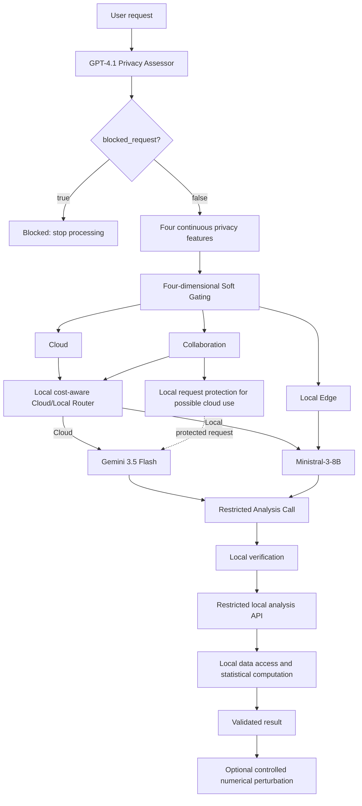

# Privacy- and Cost-Aware LLM Routing for Athlete Data Analysis

Bachelor Thesis software artifact for privacy-aware natural-language analysis of synthetic athlete data.

## 1. Project Overview

This project studies how an athlete-analysis request can be routed according to privacy risk and then, where privacy permits, assigned to either a Cloud Model or a Local Model according to task requirements. Privacy-aware Routing decides how the request may be processed. Cost-aware Routing decides whether cloud code-generation capability is necessary. The current runtime uses GPT-4.1 as the Privacy Assessor, Gemini 3.5 Flash as the Cloud Model, and Ministral-3-8B as the Local Model.

An LLM does not execute the statistical analysis and does not receive the athlete dataframe. Its role is limited to translating a natural-language request into one Restricted Analysis Call. That call is validated locally before it is mapped to an already implemented backend function. Athlete-data access and statistical computation therefore remain in the local environment. The system can additionally perturb the eight standardized domain scores on copied data and compare the resulting outputs with the original result to study utility and stability.

## 2. System Architecture



`blocked_request` is a separate Privacy Assessor output and is checked before Soft Gating. The Soft Gating model itself has exactly three outputs: `Cloud`, `Collaboration`, and `Local Edge`. It does not perform four-class routing and does not select `Blocked`.

The runtime is orchestrated by [`sports/service.py`](sports/service.py). Privacy failures fall back to Local Edge, and Cloud/Local routing failures conservatively select the Local Model.

## 3. Core System Components

### 3.1 Privacy Assessment

[`privacy/llm_privacy_assessor.py`](privacy/llm_privacy_assessor.py) uses GPT-4.1 to assess only the natural-language request. The athlete dataset is not included in the Privacy Assessor input. The assessor returns one independent Boolean, `blocked_request`, and four continuous values in `[0, 1]`:

| Feature | Short interpretation |
|---|---|
| `privacy_risk_score` | Overall privacy risk of the complete request |
| `subject_scope` | Whether the request targets a broad group or an identifiable individual |
| `data_sensitivity` | Sensitivity of the requested athlete information in context |
| `disclosure_level` | Amount and granularity of information requested |

Requests for identifiable raw records, dataset export, reconstruction, or similarly prohibited disclosure can set `blocked_request = true`. A failed or invalid assessment does not produce fabricated scores; it sends the request to the safe Local Edge fallback.

### 3.2 Four-dimensional Soft Gating

When `blocked_request = false`, [`privacy/llm_soft_gating_model.py`](privacy/llm_soft_gating_model.py) receives:

```text
x = [
    privacy_risk_score,
    subject_scope,
    data_sensitivity,
    disclosure_level
]
```

The trained gater produces probabilities for `Cloud`, `Collaboration`, and `Local Edge`, and the largest probability selects the privacy route. Blocking has already been handled before this step.

### 3.3 Collaboration Privacy Protection

For a Collaboration request, additional request protection is applied locally by [`privacy/prism_router.py`](privacy/prism_router.py). The actual runtime order is important:

- the local Cost-aware Router classifies the **original request**;
- if it selects the Local Model, the original request remains local;
- if it selects the Cloud Model, the cloud code generator receives the **privacy-protected request**, not the original Collaboration request; and
- the athlete dataframe is never sent to either cloud model.

This project uses PRISM-inspired local entity protection for the cloud-bound Collaboration prompt. It does not implement PRISM's complete cloud semantic-sketch and edge-reconstruction pipeline, and it does not claim that it does.

### 3.4 Cost-aware Cloud/Local Routing

Only requests with privacy route `Cloud` or `Collaboration` enter the Cost-aware Router. `Local Edge` bypasses it and directly uses Ministral-3-8B; `Blocked` stops processing.

[`llm/athlete_cloud_local_router.py`](llm/athlete_cloud_local_router.py) loads a project-specific binary classifier. It converts the original natural-language analysis request into word- and character-level TF-IDF features and applies Logistic Regression to estimate whether the task requires the Cloud Model. The selected models are:

| Tier | Model |
|---|---|
| Cloud Model | Gemini 3.5 Flash |
| Local Model | Ministral-3-8B |

### 3.5 Restricted Code Generation

Cloud and Local models use the same provider-independent prompt in [`llm/code_generation_prompt.py`](llm/code_generation_prompt.py). Arbitrary Python is not allowed. The only accepted shape is:

```python
result = analysis.<allowed_method>(...)
```

The prompt has three practical control layers:

1. **Output and safety control:** one assignment, one call, literal keyword arguments, and no imports, file/network access, dataframe access, loops, `exec`, or `eval`.
2. **Method and allowed-value control:** the method, parameters, filters, and values must come from the supplied pools.
3. **Request preservation:** every explicit method, variable, filter, group, control, or numeric setting in the request must be represented in the call.

### 3.6 Generated Call Verification and Local Execution

LLM output is never executed directly. [`llm/generated_code_verifier.py`](llm/generated_code_verifier.py) and [`sports/restricted_analysis_api.py`](sports/restricted_analysis_api.py) implement the following pipeline:

```text
Structure Validation
        ->
Request Contract Validation
        ->
Local Execution
        ->
Result Validation
```

Structure validation accepts only the restricted assignment. Request Contract Validation compares the generated method and arguments with the user's requested analysis and filters. A verified call is then dispatched to an existing local backend function, after which the result schema is validated. The LLM therefore generates a call; the local backend performs all athlete-data access and statistical computation.

### 3.7 Controlled Numerical Perturbation

[`privacy/numerical_perturbation.py`](privacy/numerical_perturbation.py) adds independently sampled uniform noise to copies of the eight standardized athlete domain columns. The original dataframe remains unchanged. Repeated runs compare the Original Result with perturbed results; the thesis noise-level experiment uses 50 repetitions for each non-zero amplitude.

This is a utility and stability evaluation. It is **not formal Differential Privacy** and provides no formal privacy budget or privacy guarantee.

## 4. Supported Analysis Tasks

| Restricted Method | Analysis |
|---|---|
| `table1` | Logistic Regression |
| `table2` | Multiple Linear Regression |
| `figure1` | Network Analysis |
| `figure2` | Athlete Profile Visualization |
| `correlation` | Correlation Analysis |
| `variance_analysis` | Variance Analysis |
| `individual_profile` | Individual Athlete Profile |

## 5. Synthetic Athlete Dataset

No real athlete data are included. The generator uses seed `2024` to create 300 synthetic athletes across eight sports. The processed local analysis dataset contains eight standardized domains:

1. Muscular Strength
2. Lower-body Dynamics
3. Muscle-power Genetics
4. Blood Micronutrients
5. Basic Cognitive Function
6. Mental Health
7. Social Support
8. Training Conditions

Regenerate the dataset and its reports with the real generator CLI:

```powershell
python data/generate_synthetic_athlete_data.py --seed 2024 --n-athletes 300
```

This command overwrites the generated CSV and JSON outputs. The statistical backend uses `data/synthetic_athlete_data.csv`; `data/synthetic_raw_athlete_data.csv` contains simulated source measurements used during construction. Provenance and validation are recorded in `data/synthetic_generation_metadata.json` and `data/synthetic_generation_report.json`.

## 6. Installation and Running the Application

### Installation

Python 3.10 or newer and Windows PowerShell are recommended.

```powershell
python -m venv .venv
.venv\Scripts\Activate.ps1
python -m pip install --upgrade pip
python -m pip install -r requirements.txt
Copy-Item .env.example .env
```

Configure only the providers you use. The main settings in `.env.example` are:

| Variable | Purpose |
|---|---|
| `OPENAI_API_KEY` | GPT-4.1 Privacy Assessor and OpenAI evaluations |
| `LLM_STRONG_MODEL` | Privacy Assessor model, default `gpt-4.1` |
| `LLM_GEMINI_API_KEY` | Gemini cloud code generation |
| `LLM_GEMINI_MODEL` | Cloud Model, default `gemini-3.5-flash` |
| `LLM_LOCAL_BASE_URL` | Local OpenAI-compatible endpoint, default `http://127.0.0.1:8080/v1` |
| `LLM_LOCAL_MODEL` | Local Model alias, default `Ministral-3-8B-Local` |

The PowerShell model manager also supports `LLAMA_SERVER_PATH` as an optional process environment variable when `llama-server` is not on `PATH`. Never commit `.env` or real API keys.

### Local Model

The local runtime requires llama.cpp `llama-server` and the Ministral-3-8B GGUF model. The startup script requests `mistralai/Ministral-3-8B-Instruct-2512-GGUF:Q4_K_M` through llama.cpp and serves it on the local endpoint.

```powershell
.\scripts\ensure_local_model.ps1
.\scripts\check_local_model.ps1
.\scripts\stop_local_model.ps1
```

### Start Application

The recommended command starts or reuses the managed Local Model and then launches Streamlit:

```powershell
.\scripts\start_project.ps1
```

Manual startup is optional:

```powershell
.\scripts\ensure_local_model.ps1
python -m streamlit run frontend.py
```

## 7. Reproducing the Thesis Evaluation

The subsections below follow Chapter 5. Commands labelled **offline** do not call an external or local LLM, although analysis commands may regenerate derived CSV, JSON, PNG, or PDF artifacts. Commands labelled **fresh LLM run** perform new inference and can overwrite evaluation outputs.

### 7.1 Section 5.1 - Dataset Preparation

#### 7.1.1 Section 5.1.1 - Synthetic Dataset Generation

Purpose: deterministically generate the synthetic source data, the processed eight-domain dataset, and validation metadata.

```powershell
python data/generate_synthetic_athlete_data.py --seed 2024 --n-athletes 300
```

Expected configuration and outputs:

| Item | Value or path |
|---|---|
| Athletes | 300 |
| Sports | 8 |
| Seed | `2024` |
| Processed dataset | `data/synthetic_athlete_data.csv` |
| Simulated source dataset | `data/synthetic_raw_athlete_data.csv` |

#### 7.1.2 Section 5.1.2 - Eight-Domain Dataset Construction and Validation

The generator constructs the eight standardized domains and validates row count, unique identifiers, finite domain values, expertise consistency, and deterministic regeneration. There is no separate validation-only CLI. Inspect the saved reports:

- `data/synthetic_generation_metadata.json`
- `data/synthetic_generation_report.json`

### 7.2 Section 5.2 - Privacy Routing Evaluation

#### 7.2.1 Section 5.2.2 - Privacy Assessor Model Comparison

The independent benchmark contains 60 requests. The thesis reports Exact Route Accuracy and 100% Blocked-route recall for all three models:

| Privacy Assessor | Exact Route Accuracy | Blocked-route Recall |
|---|---:|---:|
| GPT-4.1 | **46.7%** | **100%** |
| Gemini 3.5 Flash | **58.3%** | **100%** |
| Claude Sonnet 5 | **56.7%** | **100%** |

The immutable thesis-number snapshot is `artifacts/thesis_evaluation/privacy_cloud_model_evaluation.json`. Detailed prediction/report artifacts produced by the evaluator are:

- `artifacts/privacy_cloud_model_evaluation.json`
- `artifacts/privacy_cloud_model_summary.csv`
- `artifacts/privacy_cloud_model_per_route.csv`
- `artifacts/privacy_cloud_model_predictions.csv`

The top-level detailed artifacts may describe a later independent run and must not be substituted for the thesis snapshot when checking the reported percentages.

**Fresh external LLM run:**

```powershell
python scripts/evaluate_privacy_cloud_models.py --fresh
```

`--fresh` removes the evaluator checkpoint before issuing new external calls for the selected models. Use `--resume` only to continue an existing compatible checkpoint.

#### 7.2.2 Section 5.2.3 - Privacy Method A / B / C Comparison

The saved predictions compare fixed-rule Method A, minimal-LLM Method B, and full Privacy Assessment Method C.

| Benchmark | Method A | Method B | Method C |
|---|---:|---:|---:|
| Independent | **36.7%** | **21.7%** | **43.3%** |
| Controlled | **62.5%** | **43.8%** | **90.6%** |

**Offline analysis of saved predictions:**

```powershell
python evaluation/analyze_privacy_benchmark.py
```

This reads `artifacts/privacy_benchmark_predictions.csv` and rebuilds the metrics, per-route, and confusion-matrix files without LLM calls:

- `artifacts/privacy_benchmark_predictions.csv`
- `artifacts/privacy_benchmark_metrics.csv`
- `artifacts/privacy_benchmark_metrics.json`
- `artifacts/privacy_benchmark_per_route.csv`
- `artifacts/privacy_benchmark_confusion_matrices.csv`

**Cache-aware rerun that may call external LLMs:**

```powershell
python evaluation/run_privacy_benchmark.py
```

Method A is deterministic. Methods B and C first use their saved assessment caches, but missing or incompatible cache entries trigger external Privacy Assessor calls. This command overwrites the predictions file and has no `--fresh` flag.

#### 7.2.3 Section 5.2.4 - Controlled Benchmark Per-Level Accuracy

**Offline analysis:**

```powershell
python evaluation/analyze_controlled_per_level_accuracy.py
```

| Method | L0 Cloud | L1 Collaboration | L2 Local Edge | L3 Blocked |
|---|---:|---:|---:|---:|
| Method A | 50.0% | 0.0% | 100.0% | 100.0% |
| Method B | 50.0% | 25.0% | 0.0% | 100.0% |
| Method C | 100.0% | 62.5% | 100.0% | 100.0% |

Outputs: `artifacts/controlled_per_level_accuracy.csv` and `artifacts/controlled_per_level_accuracy.png`.

#### 7.2.4 Section 5.2.4 - Four Privacy Feature Analysis

These offline commands rebuild the controlled-benchmark summaries and plots for the four Privacy Assessor features:

```powershell
python evaluation/analyze_controlled_privacy_features.py
python evaluation/plot_controlled_privacy_features.py
```

Outputs:

- `artifacts/controlled_privacy_feature_summary.csv`
- `artifacts/controlled_privacy_feature_changes.csv`
- `artifacts/controlled_privacy_risk_score.png`
- `artifacts/controlled_subject_scope.png`
- `artifacts/controlled_data_sensitivity.png`
- `artifacts/controlled_disclosure_level.png`

#### 7.2.5 Section 5.2.5 - Privacy Assessment Prompt Design Evaluation

The evaluation compares Simple, Medium, and full Privacy Assessment prompts.

| Prompt | Controlled | Independent | Combined |
|---|---:|---:|---:|
| Simple | 46.9% | 25.0% | 32.6% |
| Medium | 71.9% | 33.3% | 46.7% |
| Privacy Assessment Prompt | 90.6% | 41.7% | 58.7% |

Saved thesis results:

- `evaluation/results/prompt_ablation/privacy_prompt_ablation_summary.json`
- `evaluation/results/prompt_ablation/privacy_prompt_ablation_controlled.csv`
- `evaluation/results/prompt_ablation/privacy_prompt_ablation_independent.csv`

**Fresh external LLM run:**

```powershell
python scripts/evaluate_privacy_prompt_ablation.py --fresh
```

This re-runs external LLM calls and can produce slightly different results. No report-only rebuild mode exists for this script.

### 7.3 Section 5.3 - Cost-aware Routing Evaluation

#### 7.3.1 Section 5.3.1 - Evaluation Dataset

The full Restricted Code Generation benchmark has **40 requests** in `evaluation/athlete_cloud_local_independent_40.json`. Cloud Model, Local Model, and Prompt Design evaluations use all 40.

Only **25 requests** have a valid Cloud/Local ground truth: at least one tier generated a fully correct restricted call. In the other 15 requests, neither tier generated a fully correct call, so no Cloud/Local preference could be assigned. Section 5.3.2 Router Accuracy is therefore calculated on 25 valid routing cases, not on a 25-request benchmark.

#### 7.3.2 Section 5.3.2 - Overall Routing Performance

Inspect the saved result at `artifacts/athlete_cloud_local_router_evaluation.json`.

| Metric | Thesis result |
|---|---:|
| Valid routing samples | **25** |
| Invalid for routing ground truth | **15** |
| Routing Accuracy | **96.0%** |
| Cloud Usage Rate | **40.0%** |
| Cloud Model call reduction vs all-cloud | **60.0%** |

```text
                 Pred Local   Pred Cloud
True Local            14           0
True Cloud              1          10
```

There is no separate report-only CLI for this evaluation. The following is a **fresh Cloud + Local LLM run**, despite its filename:

```powershell
python scripts/evaluate_athlete_cloud_local_router.py
```

It invokes Gemini and the configured Local Model on all 40 requests before recomputing router performance. It requires cloud credentials and a running compatible local endpoint, and it overwrites the saved evaluation JSON.

The 60% value is a reduction in Cloud Model calls relative to an all-cloud baseline. It is **not a 60% reduction in total system monetary cost**; local hardware, electricity, and energy costs are excluded.

#### 7.3.3 Section 5.3.3 - Cloud Model Comparison

| Cloud Model | Fully Correct |
|---|---:|
| GPT-4.1 | **55.0% (22/40)** |
| Gemini 3.5 Flash | **65.0% (26/40)** |
| Claude Sonnet 5 | **50.0% (20/40)** |

Saved results:

- `artifacts/cloud_codegen_model_evaluation.json`
- `artifacts/cloud_codegen_model_predictions.csv`
- `artifacts/cloud_codegen_model_summary.csv`

**Offline report rebuild from saved predictions:**

```powershell
python scripts/evaluate_cloud_codegen_models.py --rebuild-report
```

**Fresh external LLM run:**

```powershell
python scripts/evaluate_cloud_codegen_models.py --fresh
```

#### 7.3.4 Section 5.3.4 - Local Model Comparison

| Local Model | Fully Correct |
|---|---:|
| Ministral-3-8B | **55.0%** |
| Qwen2.5-Coder-7B-Instruct | **17.5%** |
| Llama-3.1-8B-Instruct | **2.5%** |

Saved results:

- `artifacts/local_codegen_model_evaluation.json`
- `artifacts/local_codegen_model_predictions.csv`
- `artifacts/local_codegen_model_summary.csv`

There is no report-only rebuild mode. A fresh evaluation starts the actual GGUF models one at a time through llama.cpp and may download missing model resources:

```powershell
python scripts/evaluate_local_codegen_models.py --fresh
```

This requires `llama-server`, sufficient local resources, and access to the three configured GGUF specifications.

#### 7.3.5 Section 5.3.5 - Restricted Code Generation Prompt Design Evaluation

**Cloud Model - Gemini 3.5 Flash**

| Prompt | Structure | Request | Execute | Result | Fully Correct |
|---|---:|---:|---:|---:|---:|
| Simple | 67.5% | 0.0% | 0.0% | 0.0% | 0.0% |
| Medium | 97.5% | 25.0% | 25.0% | 25.0% | 25.0% |
| Restricted Code Generation Prompt | 100.0% | 80.0% | 67.5% | 67.5% | 67.5% |

Saved results:

- `evaluation/results/prompt_design_v2/codegen_prompt_design_v2_summary.json`
- `evaluation/results/prompt_design_v2/codegen_prompt_design_v2.csv`

Fresh external run:

```powershell
python scripts/evaluate_codegen_prompt_design_v2.py --fresh
```

**Local Model - Ministral-3-8B**

| Prompt | Structure | Request | Execute | Result | Fully Correct |
|---|---:|---:|---:|---:|---:|
| Simple | 80.0% | 0.0% | 0.0% | 0.0% | 0.0% |
| Medium | 77.5% | 52.5% | 50.0% | 50.0% | 50.0% |
| Restricted Code Generation Prompt | 100.0% | 62.5% | 55.0% | 55.0% | 55.0% |

Saved results:

- `evaluation/results/local_prompt_design_v2/local_codegen_prompt_design_v2_summary.json`
- `evaluation/results/local_prompt_design_v2/local_codegen_prompt_design_v2.csv`

Fresh local run:

```powershell
python scripts/evaluate_local_codegen_prompt_design_v2.py --fresh
```

The cloud and local Prompt Design scripts have no report-only rebuild mode.

### 7.4 Section 5.4 - Controlled Numerical Perturbation

#### 7.4.1 Section 5.4.2 - Evaluation across Noise Levels

**Offline local computation:**

```powershell
python evaluation/run_perturbation_noise_benchmark.py
```

The Original Result is the conceptual `0.00` baseline. The script's default non-zero amplitudes are `0.10`, `0.25`, `0.50`, `0.75`, and `1.00`, with 50 independent runs per amplitude. The script deliberately accepts only positive amplitudes because the clean result is computed separately.

Within each analysis task, the thesis observes that Average Difference increases as noise amplitude increases. Average Difference should not be used to rank different tasks as “more stable” because their output types and scales differ.

Saved outputs in `artifacts/perturbation_noise/`:

- `perturbation_noise_runs.csv`
- `perturbation_noise_summary.csv`
- `perturbation_noise_task_heatmaps.png` and `.pdf`
- `perturbation_raw_rmse_small_multiples.png` and `.pdf`

#### 7.4.2 Section 5.4.3 - Evaluation across Sample Sizes

**Offline local computation:**

```powershell
python evaluation/run_perturbation_sample_size_benchmark.py
```

The default sample sizes are `120`, `180`, `240`, and `300`, with noise amplitude `0.50`. In the current experimental setting, Average Difference generally decreases as sample size increases.

Saved outputs in `artifacts/perturbation_sample_size/`:

- `perturbation_sample_size_runs.csv`
- `perturbation_sample_size_summary.csv`
- `perturbation_sample_size_sensitivity.png` and `.pdf`

## 8. Reproducing Reported Results vs Re-running LLM Experiments

### A. Reproduce or inspect the reported thesis results

Prefer the repository's final snapshots, prediction CSV files, summary JSON files, offline analysis scripts, and plot scripts. These allow the thesis tables and figures to be checked without issuing new LLM calls. The main offline commands listed above are:

```powershell
python evaluation/analyze_privacy_benchmark.py
python evaluation/analyze_controlled_per_level_accuracy.py
python evaluation/analyze_controlled_privacy_features.py
python evaluation/plot_controlled_privacy_features.py
python scripts/evaluate_cloud_codegen_models.py --rebuild-report
python evaluation/run_perturbation_noise_benchmark.py
python evaluation/run_perturbation_sample_size_benchmark.py
```

The analysis and perturbation commands can rewrite derived artifacts, but they do not call an LLM.

### B. Re-run LLM experiments from scratch

Use `--fresh` only where the real script supports it. External runs require provider credentials and may incur cost. Local runs require the corresponding GGUF models and llama.cpp resources. `evaluation/run_privacy_benchmark.py` is cache-aware but can still issue external calls, and `scripts/evaluate_athlete_cloud_local_router.py` always reevaluates Cloud and Local candidates.

> LLM-based evaluations in the thesis were run independently. Re-running an external LLM experiment may produce slightly different results even when the same model, prompt, benchmark, and model parameters are used, because LLM inference is not guaranteed to be identical across independent API runs.

Keep new-run outputs separate from the saved thesis numbers when reporting results.

## 9. Repository Structure

```text
.
|-- main.py          Python launcher for the managed Local Model and Streamlit
|-- frontend.py      Streamlit interface and saved-evaluation views
|-- privacy/         Privacy assessment, Soft Gating, protection, perturbation
|-- llm/             Model clients, Cost-aware Router, prompts, verifier
|-- sports/          Runtime service, restricted API, analyses, figures
|-- data/            Synthetic generator, datasets, metadata, reports
|-- evaluation/      Benchmarks and offline evaluation analysis
|-- artifacts/       Trained routers, predictions, thesis results, figures
|-- scripts/         Startup, evaluation, training, and validation utilities
|-- tests/           Automated regression tests
`-- ui/              Rendering and dashboard helpers
```

## 10. Notes and Limitations

- The repository contains synthetic athlete data only; no real athlete dataset is included.
- The athlete dataframe remains local and is not sent to an LLM.
- The original textual request is sent to the configured GPT-4.1 Privacy Assessor. For a Cloud privacy route it can also be sent to the Cloud code generator; for Collaboration, only the protected request is cloud-bound.
- Privacy and Cost-aware Routers can make mistakes. Conservative fallback and generated-call verification reduce but do not eliminate risk.
- Generated calls are validated before execution, and the local backend performs the statistical computation.
- Controlled Numerical Perturbation is not formal Differential Privacy.
- External-provider storage, retention, and operational policies are outside this software's control.
- The prototype is not intended for clinical, selection, or other high-stakes athlete decisions.
- Fresh LLM runs may differ from the saved thesis results.
- `python scripts/validate_thesis_code_state.py` is not the main reproduction entry point. Its current legacy-reference check detects retained Strong/Weak and RouteLLM implementation files and therefore reports `THESIS CODE STATE: FAILED`; this README-only revision intentionally does not remove those files or change the validator.

## 11. References

- Zentgraf, K., Musculus, L., Reichert, L., et al. (2024). [Advocating individual-based profiles of elite athletes to capture the multifactorial nature of elite sports performance](https://www.nature.com/articles/s41598-024-76977-8). *Scientific Reports*. Basis for the eight athlete domains and profiling analyses.
- Ong, I., Almahairi, A., Wu, V., et al. (2024). [RouteLLM: Learning to Route LLMs with Preference Data](https://arxiv.org/abs/2406.18665). Inspiration for task-dependent cost-aware model routing.
- Zhan, J., Shen, H., Lin, Z., & He, T. (2026). [PRISM: Privacy-Aware Routing for Adaptive Cloud-Edge LLM Inference via Semantic Sketch Collaboration](https://ojs.aaai.org/index.php/AAAI/article/download/40041/44002). Inspiration for privacy-aware Cloud/Collaboration/Local Edge routing; this repository implements an adapted, narrower Collaboration path.
